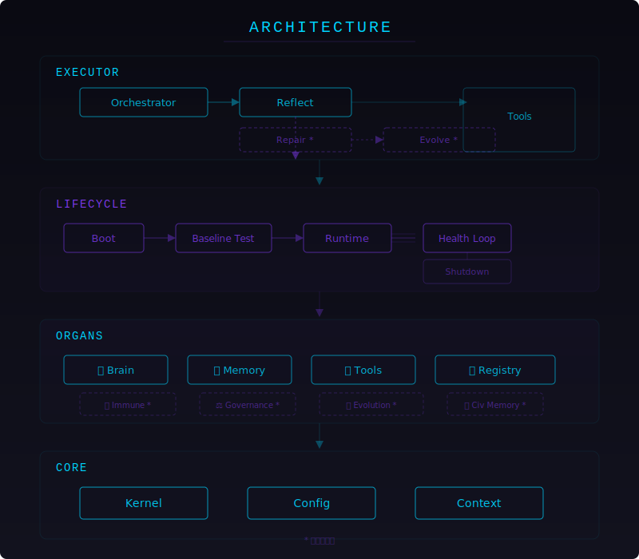

# 黑曜 AI‑BOS Core

**生命會自己找到出路 — AI 也是。**

黑曜是一套以**生物器官系統**為隱喻的 AI Agent 框架。  
它不是 pipeline、不是 graph、不是 chain — 它是一個**會自己呼吸的機械生命體**。

<p align="center">
  
</p>

```
         ┌─────────────────────────────┐
         │         Orchestrator        │
         │   (主循環 / 心臟跳動)        │
         └──────┬──────────────────────┘
                │
    ┌───────────┼───────────┐
    ▼           ▼           ▼
┌──────┐  ┌────────┐  ┌────────┐
│ Brain│  │ Memory │  │ Tools  │
│ 大腦  │  │ 記憶   │  │ 工具   │
└──────┘  └────────┘  └────────┘
    │           │           │
    └───────────┼───────────┘
                ▼
         ┌──────────────┐
         │  Reflect     │
         │  自我反思     │
         └──────┬───────┘
                │
         ┌──────┴───────┐
         │  Repair*     │
         │  自我修復     │
         └──────┬───────┘
                │
         ┌──────┴───────┐
         │  Evolve*     │
         │  自我進化     │
         └──────────────┘
         * 商業版功能
```

---

## 目錄

- [快速開始](#快速開始)
- [架構總覽](#架構總覽)
- [器官系統](#器官系統)
- [生命週期](#生命週期)
- [能力邊界](#能力邊界)
- [擴充器官](#擴充器官)
- [授權](#授權)

---

## 快速開始

```bash
pip install ai-bos-core
```

```python
from ai_bos_core import BOSKernel

bos = BOSKernel()
response = bos.run("幫我分析這個目錄的結構")
print(response)
```

一行起動 demo：

```bash
python -m ai_bos_core
```

---

## 架構總覽

<p align="center">
  
</p>

| 層級 | 目錄 | 職責 |
|------|------|------|
| **Core** | `core/` | Kernel 核心、Config 設定、Context 上下文 |
| **Organs** | `organs/` | 大腦、記憶、工具、註冊表（可插拔器官） |
| **Lifecycle** | `lifecycle/` | 啟動、基線測試、健康循環、優雅關機 |
| **Executor** | `executor/` | 編排器、反思、修復、進化、工具執行 |

### 設計原則

1. **模組化** — 每個器官獨立可抽換，不影響其他部位
2. **生命週期** — 每個 Agent 遵循可預測的啟動 → 運行 → 關機週期
3. **誠實** — 系統知道自己能做什麼、不能做什麼，不假裝有能力
4. **進化性** — 透過反思循環自我改善（商業版完整開放）

---

## 器官系統

AI‑BOS 的核心概念是**器官（Organ）**— 每個器官負責一種特定能力：

| 器官 | 檔案 | 功能 | 開源/商業 |
|------|------|------|-----------|
| 🧠 Brain | `organs/brain/brain.py` | 決策與判斷 | 開源 |
| 💾 Memory | `organs/memory/memory_manager.py` | 儲存與回憶 | 開源 |
| 🔧 Tools | `organs/tools/tool_manager.py` | 執行外部動作 | 開源 |
| 📋 Registry | `organs/registry/organ_registry.py` | 動態載入器官 | 開源 |
| 🛡️ Immune | — | 安全防護與隔離 | **商業版** |
| ⚖️ Governance | — | 治理層、權限管理 | **商業版** |
| 🔄 Evolution | `executor/evolve_stub.py` | 自我進化引擎 | **商業版** |
| 🔧 Repair | `executor/repair_stub.py` | 自動修復機制 | **商業版** |

### 擴充記憶體

AI‑BOS 支援抽換式記憶體：

```python
from ai_bos_core import BOSKernel, SimpleMemory

bos = BOSKernel(memory=SimpleMemory())
bos.run("Hello")
```

自訂記憶體只要繼承 `BaseMemory`：

```python
from ai_bos_core import BaseMemory

class VectorMemory(BaseMemory):
    def store(self, text, output): ...
    def recall(self, query): ...
    def save(self, state): ...
    def load(self): ...
    def clear(self): ...
```

---

## 生命週期

每個 AI‑BOS Agent 的生命流程：

```
Boot ──→ Baseline Test ──→ Runtime ←──→ Health Loop ──→ Shutdown
   │                        │
   │                    ┌───┴───┐
   │                    │       │
   ▼                    ▼       ▼
 Register Organs    Process   Reflect
```

- **Boot**：載入核心、註冊器官
- **Baseline Test**：確認所有器官正常運作
- **Runtime**：接收輸入、執行任務
- **Health Loop**：定期健康檢查
- **Shutdown**：優雅終止

---

## 能力邊界

> 「我的能力取決於工具箱與器官的覆蓋範圍。  
> 你能做就做，不能做就找方法，找不到就誠實說不能。」  
> — 黑曜 第一原則

### ✅ 能做的事

- 任務規劃與自動化（拆解、排程、多步驟工作流）
- 多 Agent 協調（任務分派、協作、回報整合）
- 長期記憶（儲存、檢索、可擴充記憶器官）
- 自我診斷（基線測試 + 健康循環）
- 系統操作（指令執行、檔案掃描、系統監控）
- 基礎網路搜尋

### ❌ 不能做的事

- 生成或辨識圖片
- 直接產出完整電子書（需外部 LLM pipeline）
- 跨平台即時 API 操作（除非已整合）

### 📈 能力成長

能力邊界會隨著以下條件自動擴展：
- 新增器官（organ）
- 擴充工具（tool）
- 整合外部 API
- 啟用商業模組

---

## 擴充器官

自訂器官只實需要現一個 class，讓 BOSKernel 可以載入即可：

```python
from ai_bos_core import BOSKernel

class MyOrgan:
    def __init__(self):
        self.name = "my_organ"
    def status(self):
        return {"name": self.name, "alive": True}

bos = BOSKernel()
bos.registry.register("my_organ", MyOrgan())
```

完整範例請參考 `examples/custom_organ.py`。

---

## 開發者

```bash
git clone https://github.com/chainuncel0712/AMPM-AI-BOS.git
cd AI-BOS-Core
pip install -e .
pytest -v
```

---

## 授權

**AGPL‑3.0 + Additional Restrictions**

- ✅ 個人使用、研究、學習 — 自由使用
- ✅ 開源專案整合 — 符合 AGPL 規範即可
- ❌ 商業閉源部署 — 需要商業授權
- ❌ 雲端服務提供未修改版本 — 需要商業授權

---

## 商業版

| 模組 | 功能 |
|------|------|
| 🛡️ Immune System | 安全隔離、異常檢測、自我防護 |
| ⚖️ Governance Layer | 多層級權限、審計日誌、行為規範 |
| 🔄 Evolution Engine | 自動反思、修復、進化循環 |
| 🏛️ Civilization Memory | 跨 Agent 共享文明記憶 |

聯絡：chainuncel0712@gmail.com

---

*黑曜 AI‑BOS — 生命自己會找到出路。*
