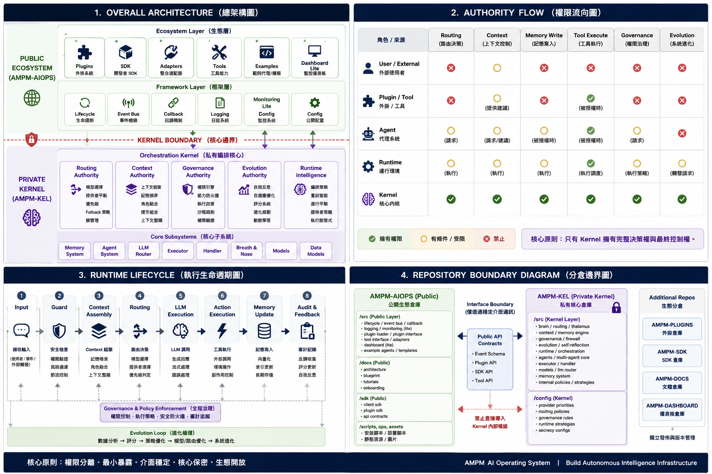

  

<h1 align="center" style="color:#e94560; border-bottom:1px solid #30363d; padding-bottom:8px;">
AMPM AI Operating System 
Architecture Direction & Repository Refactor
</h1>
<h1 align="center" style="color:#e94560; border-bottom:1px solid #30363d; padding-bottom:8px; margin-top:-10px;">
AMPM AI 作業系統 
架構方向與倉庫重構規範
</h1>

 

---

<h2 align="center" style="color:#58a6ff;">1. Project Positioning · 專案定位</h2>

AMPM is no longer a standard bot framework or automation project. 
The system has evolved into an experimental <strong style="color:#e94560;">AI Operating System</strong> architecture.

AMPM 不再是標準的機器人框架或自動化專案。 
系統已進化為實驗性的 <strong style="color:#e94560;">AI 作業系統</strong>架構。

 

<strong>Focused on · 專注於：</strong> 
Orchestration · Runtime Intelligence · Governance · Memory Systems 
Multi-Agent Coordination · Autonomous Infrastructure

 

<strong style="color:#e94560;">The objective is not to build another chatbot.</strong> 
The objective is to build an AI runtime environment capable of coordinating: 
models · memory · tools · execution · permissions · lifecycle · adaptive behavior 
under a unified orchestration system.

<strong style="color:#e94560;">目標不是建立另一個聊天機器人。</strong> 
目標是建立一個 AI 執行環境，能夠在統一協調系統下 
協調模型、記憶、工具、執行、權限、生命週期、自適應行為。

 

---

<h2 align="center" style="color:#58a6ff;">2. Core Philosophy · 核心哲學</h2>

Modern AI systems are fragmented. 
Models, memory, tools, agents, and execution layers typically operate independently 
with minimal governance or orchestration.

現代 AI 系統是破碎的。 
模型、記憶、工具、代理和執行層通常各自獨立運作， 
幾乎沒有治理或協調。

 

AMPM explores a different architecture: 
<strong style="color:#e94560;">An AI Operating System</strong> where:

AMPM 探索不同的架構： 
<strong style="color:#e94560;">AI 作業系統</strong>，其中：

✅ Orchestration is centralized · 協調集中化 
✅ Authority is controlled · 權限受控 
✅ Execution is sandboxed · 執行沙箱化 
✅ Memory is structured · 記憶結構化 
✅ Runtime behavior is governed · 執行行為受治理 
✅ Plugins remain isolated from kernel authority · 插件隔離於核心權限之外

 

<strong>The system must be designed as infrastructure, not as a monolithic chatbot.</strong>

<strong>系統必須設計為基礎設施，而不是單體聊天機器人。</strong>

 

---

<h2 align="center" style="color:#58a6ff;">3. Repository Segmentation · 倉庫分割</h2>

The project must now be separated into: 
Public Ecosystem Layer · Private Kernel Layer · Modular Public Subsystems

專案現在必須拆分為： 
公開生態層 · 私有核心層 · 模組化公開子系統

 

<h3 align="center" style="color:#2ea043;">Mandatory for · 必須拆分以確保：</h3>

Maintainability · 可維護性 
Authority Isolation · 權限隔離 
IP Protection · 智慧財產保護 
Ecosystem Scalability · 生態系統可擴展性 
Governance Enforcement · 治理執行

 

---

<h2 align="center" style="color:#58a6ff;">4. Public Ecosystem · 公開生態</h2>

<h3 align="center" style="color:#e94560;">Repository · 倉庫</h3>

<code style="background:#1a1a2e; color:#e94560; padding:4px 16px; border-radius:4px;">AMPM-AIOPS</code>

<h3 align="center" style="color:#2ea043;">Purpose · 目的</h3>

Public AI OS ecosystem framework · 公開 AI 作業系統生態框架

 

<h3 align="center" style="color:#2ea043;">Responsibilities · 職責</h3>

<h4 align="center" style="color:#58a6ff;">Framework Layer · 框架層</h4>

SDK interfaces · SDK 介面 
Plugin interfaces · 插件介面 
Lifecycle system · 生命週期系統 
Event bus · 事件總線 
Callback flow · 回呼流程 
Logging · 日誌 
Monitoring lite · 輕量監控

<h4 align="center" style="color:#58a6ff;">Ecosystem Layer · 生態層</h4>

Plugins · 插件 
Adapters · 適配器 
Integrations · 整合 
Public tools · 公開工具 
Example agents · 範例代理 
Templates · 模板

<h4 align="center" style="color:#58a6ff;">Documentation Layer · 文件層</h4>

Architecture docs · 架構文件 
Tutorials · 教學 
Onboarding · 入門引導 
Diagrams · 圖表 
Public API contracts · 公開 API 合約

<h4 align="center" style="color:#58a6ff;">UI Layer · UI 層</h4>

Dashboard lite · 輕量儀表板 
Runtime visualization · 執行視覺化 
Monitoring UI · 監控介面

 

<h3 align="center" style="color:#e94560;">Public Repository Restrictions · 公開倉庫限制</h3>

<strong style="color:#e94560;">The public repository must never contain:</strong> 
<strong style="color:#e94560;">公開倉庫永遠不能包含：</strong>

❌ Routing intelligence · 路由智慧 
❌ Orchestration logic · 協調邏輯 
❌ Governance rules · 治理規則 
❌ Capability enforcement · 能力執行 
❌ Memory weighting · 記憶權重 
❌ Provider strategy · 提供商策略 
❌ Adaptive optimization · 自適應優化 
❌ Runtime authority · 執行權限 
❌ Hidden orchestration hooks · 隱藏協調鉤子 
❌ Internal scoring systems · 內部評分系統

 

<strong style="color:#e94560;">The public repository is a framework layer only.</strong> 
It must not contain the actual AI brain.

<strong style="color:#e94560;">公開倉庫僅是框架層。</strong> 
它不得包含真正的 AI 大腦。

 

---

<h2 align="center" style="color:#58a6ff;">5. Private Kernel · 私有核心</h2>

<h3 align="center" style="color:#e94560;">Repository · 倉庫</h3>

<code style="background:#1a1a2e; color:#e94560; padding:4px 16px; border-radius:4px;">AMPM-KEL</code>

<h3 align="center" style="color:#2ea043;">Purpose · 目的</h3>

Private orchestration kernel and runtime intelligence layer. 
私有協調核心與執行智慧層。

<strong style="color:#e94560;">This repository contains all authority-bearing systems.</strong> 
Only core maintainers may access this repository.

<strong style="color:#e94560;">此倉庫包含所有具權限的系統。</strong> 
僅核心維護者可以存取此倉庫。

 

<h3 align="center" style="color:#2ea043;">Kernel Authority Systems · 核心權限系統</h3>

<h4 align="center" style="color:#e94560;">Routing Authority · 路由權限</h4>

Responsible for · 負責： 
Model selection · 模型選擇 
Provider balancing · 提供商平衡 
Fallback strategy · 備援策略 
Execution priority · 執行優先級 
Orchestration routing · 協調路由 
Lock management · 鎖定管理

Examples: Thalamus, Router, Provider Selector, Priority Engine 
範例：視丘、路由器、提供商選擇器、優先級引擎

 

<h4 align="center" style="color:#e94560;">Context Authority · 上下文權限</h4>

Responsible for · 負責： 
Context assembly · 上下文組裝 
Memory ranking · 記憶排名 
Persona merge · 人格合併 
Prompt composition · 提示組合 
Context compression · 上下文壓縮 
Context filtering · 上下文過濾

🔑 Who controls context controls the AI. 
誰控制上下文，誰就控制了 AI。

 

<h4 align="center" style="color:#e94560;">Governance Authority · 治理權限</h4>

Responsible for · 負責： 
Permission enforcement · 權限執行 
Capability firewall · 能力防火牆 
Sandbox policies · 沙箱策略 
Authority validation · 權限驗證 
Execution restrictions · 執行限制 
Runtime policies · 執行政策

 

<h4 align="center" style="color:#e94560;">Evolution Authority · 演化權限</h4>

Responsible for · 負責： 
Adaptive optimization · 自適應優化 
Runtime learning · 執行學習 
Self reflection · 自我反思 
Scoring systems · 評分系統 
Evolutionary planning · 演化規劃

 

<h4 align="center" style="color:#e94560;">Runtime Intelligence · 執行智慧</h4>

Responsible for · 負責： 
Orchestration policies · 協調政策 
Retry intelligence · 重試智慧 
Provider balancing · 提供商平衡 
Execution heuristics · 執行啟發式 
Internal coordination · 內部協調 
Runtime optimization · 執行優化

 

---

<h2 align="center" style="color:#58a6ff;">6. Migration Mandate · 遷移命令</h2>

<h3 align="center" style="color:#e94560;">Move Immediately · 立即搬移</h3>

The following must not remain inside the public repository: 
以下不得留在公開倉庫中：

<code style="background:#1a1a2e; color:#e94560; padding:2px 10px; border-radius:3px;">src/brain/</code> 
<code style="background:#1a1a2e; color:#e94560; padding:2px 10px; border-radius:3px;">src/governance/</code> 
<code style="background:#1a1a2e; color:#e94560; padding:2px 10px; border-radius:3px;">src/runtime/</code> 
<code style="background:#1a1a2e; color:#e94560; padding:2px 10px; border-radius:3px;">src/core/</code> 
<code style="background:#1a1a2e; color:#e94560; padding:2px 10px; border-radius:3px;">src/compass/</code> 
<code style="background:#1a1a2e; color:#e94560; padding:2px 10px; border-radius:3px;">src/decisions/</code> 
<code style="background:#1a1a2e; color:#e94560; padding:2px 10px; border-radius:3px;">src/agents.py</code> 
<code style="background:#1a1a2e; color:#e94560; padding:2px 10px; border-radius:3px;">src/llm.py</code> 
<code style="background:#1a1a2e; color:#e94560; padding:2px 10px; border-radius:3px;">src/memory.py</code> 
<code style="background:#1a1a2e; color:#e94560; padding:2px 10px; border-radius:3px;">src/memory_vector.py</code> 
<code style="background:#1a1a2e; color:#e94560; padding:2px 10px; border-radius:3px;">src/models.py</code> 
<code style="background:#1a1a2e; color:#e94560; padding:2px 10px; border-radius:3px;">src/executor.py</code> 
<code style="background:#1a1a2e; color:#e94560; padding:2px 10px; border-radius:3px;">src/handler.py</code> 
<code style="background:#1a1a2e; color:#e94560; padding:2px 10px; border-radius:3px;">src/breath.py</code> 
<code style="background:#1a1a2e; color:#e94560; padding:2px 10px; border-radius:3px;">src/nose.py</code> 
<code style="background:#1a1a2e; color:#e94560; padding:2px 10px; border-radius:3px;">src/civilization_controller.py</code>

 

<h3 align="center" style="color:#d29922;">Conditional Audit · 有條件審查</h3>

The following files must be reviewed and moved if they contain authority-bearing logic: 
以下文件必須審查，若包含權限邏輯則搬移：

<strong style="color:#58a6ff;">decisions.py</strong> 
Move if contains: routing, orchestration, agent selection, priority logic, execution flow 
包含路由、協調、代理選擇、優先級邏輯、執行流程則搬移

<strong style="color:#58a6ff;">evolution_module.py</strong> 
Move if contains: adaptive logic, optimization, runtime learning, self-modification, growth systems 
包含自適應邏輯、優化、執行學習、自我修改、成長系統則搬移

<strong style="color:#58a6ff;">civilization_controller.py</strong> 
Move if contains: multi-agent orchestration, civilization memory, strategic coordination, governance logic 
包含多代理協調、文明記憶、戰略協調、治理邏輯則搬移

<strong style="color:#58a6ff;">config.py</strong> 
Must be split into: public configuration + kernel configuration 
必須拆分為：公開配置 + 核心配置

 

---

<h2 align="center" style="color:#58a6ff;">7. Plugin Security · 插件安全</h2>

Plugins are capability providers only. 
Plugins must never possess authority.

插件僅是能力提供者。插件永遠不能擁有權限。

 

<h3 align="center" style="color:#2ea043;">Plugins MAY · 插件可以</h3>

✅ Execute tools · 執行工具 
✅ Return structured outputs · 回傳結構化輸出 
✅ Provide context candidates · 提供上下文候選 
✅ Expose external integrations · 暴露外部整合

<h3 align="center" style="color:#e94560;">Plugins MUST NOT · 插件不能</h3>

❌ Modify routing · 修改路由 
❌ Modify governance · 修改治理 
❌ Modify permissions · 修改權限 
❌ Modify memory ranking · 修改記憶排名 
❌ Modify orchestration flow · 修改協調流程 
❌ Inject hidden prompts · 注入隱藏提示 
❌ Alter runtime authority · 改變執行權限

 

---

<h2 align="center" style="color:#58a6ff;">8. Required Documentation · 必要文件</h2>

| Document | Purpose |
|:---|:---|
| <strong>ARCHITECTURE_KERNEL.md</strong> | Kernel boundaries, authority ownership, orchestration hierarchy |
| <strong>PUBLIC_API.md</strong> | Public interfaces, SDK contracts, plugin contracts |
| <strong>PLUGIN_SECURITY.md</strong> | Plugin sandbox rules, capability restrictions, authority limits |
| <strong>SPLIT_REPORT.md</strong> | Migrated systems, public systems, restricted systems |

<em>Direct internal imports are prohibited. · 直接內部導入是被禁止的。</em>

 

---

<h2 align="center" style="color:#58a6ff;">9. Runtime Enforcement · 執行強制</h2>

<strong style="color:#e94560;">The following are prohibited outside the kernel:</strong> 
<strong style="color:#e94560;">以下禁止在核心外部執行：</strong>

❌ Self-modifying runtime · 自我修改執行環境 
❌ Autonomous routing rewrites · 自主路由重寫 
❌ Unrestricted memory mutation · 無限制記憶變異 
❌ Plugin-based authority escalation · 基於插件的權限提升 
❌ Hidden orchestration hooks · 隱藏協調鉤子 
❌ Circular authority control · 循環權限控制

 

---

<h2 align="center" style="color:#58a6ff;">10. Strategic Goal · 戰略目標</h2>

| Repository · 倉庫 | Role · 角色 |
|:---|---:|
| <strong style="color:#2ea043;">AMPM-AIOPS</strong> | Public ecosystem framework · 公開生態框架 |
| <strong style="color:#e94560;">AMPM-KEL</strong> | Private orchestration kernel · 私有協調核心 |

 

---

<h2 align="center" style="color:#58a6ff;">11. Final Principle · 最終原則</h2>

<strong style="color:#8b949e;">The primary intellectual property is not:</strong> 
<strong style="color:#8b949e;">主要智慧財產不是：</strong>

bots · dashboards · plugins · tools 
機器人 · 儀表板 · 插件 · 工具

 

<strong style="color:#e94560;">The true system value is:</strong> 
<strong style="color:#e94560;">系統的真正價值是：</strong>

✅ Orchestration intelligence · 協調智慧 
✅ Routing systems · 路由系統 
✅ Context authority · 上下文權限 
✅ Governance enforcement · 治理執行 
✅ Adaptive runtime intelligence · 自適應執行智慧

 

These systems must remain: 
isolated · private · authority-controlled · non-public · kernel-bound

這些系統必須保持： 
隔離 · 私有 · 權限控制 · 非公開 · 核心綁定

at all times · 始終如此

 

  AMPM-AIOPS — AI OS Public Framework

