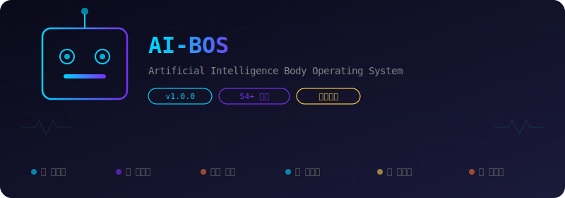

<div align="center">



<br>

[](#license)
[](/#)
[](/#)
[](#requirements)

<br>

> **一台擁有器官的機器人。**  
> 54+ 個機械器官協同運轉 —— 思考、記憶、行動、修復、進化。  
> 不是框架，是活著的機械生命體。

<br>

```
         ╭──────────────────────────────╮
         │         🤖  AI-BOS          │
         │   ╭──────────────────────╮   │
         │   │  🧠  動力核心        │   │
         │   │  💾  資料庫          │   │
         │   │  🛡️  裝甲系統        │   │
         │   │  👃  感測陣列        │   │
         │   │  💪  傳動機構        │   │
         │   │  🧬  升級艙          │   │
         │   │  🔧  維修站          │   │
         │   ╰──────────────────────╯   │
         ╰──────────────────────────────╯
```

</div>

---

<br>

<div align="center">

# ⚙️ ENGLISH

</div>

## 🤖 What is AI-BOS?

**AI-BOS is a robot with organs.**

Most AI frameworks treat AI as software — write code, chain prompts, pray it works.  
AI-BOS treats AI as a **mechanical lifeform** — 54+ robotic organs working as one body.

```
  ╭──────────────────────────────────────────────────────╮
  │                                                       │
  │   🎯 INPUT                                          │
  │     ↓                                                │
  │   👃 [感測器] ──→ 🧠 [處理器] ──→ 🛡️ [過濾器]        │
  │     Sensor        Processor        Shield             │
  │                        ↓                             │
  │                   💾 [資料庫]                        │
  │                     Database                         │
  │                        ↓                             │
  │                   💪 [制動器] ──→ 📤 OUTPUT           │
  │                     Actuator                         │
  │                                                       │
  │   🔧 [自檢迴路]   🧬 [升級迴路]   🔄 [循環系統]      │
  │                                                       │
  ╰──────────────────────────────────────────────────────╯
```

> Not a framework. A mechanical lifeform — built to survive, upgrade, and evolve.

### ⚙️ Mechanical Organs

| Module | Function | Status |
|--------|----------|--------|
| 🧠 **Processor** (cortex, thalamus) | Thinking, routing, decision | 🔋 Active |
| 💾 **Storage** (working, semantic, episodic) | Multi-layer memory | 💾 24/7 |
| 🛡️ **Armor** (firewall, guard) | Security, anomaly shield | 🛡️ Online |
| 👃 **Sensor** (nose, breath) | Environment scan, pacing | 📡 Scanning |
| 💪 **Actuator** (executor, tools) | Tool execution, action | ⚡ Ready |
| 🔄 **Conveyor** (blood, scheduler) | Message bus, timing | ⏱️ Synced |
| 🧬 **Upgrader** (self_evolve, meta_cognition) | Self-improvement | 📈 Learning |
| 🔧 **Repair Bay** (self_heal, orchestrator) | Auto-diagnosis, repair | 🛠️ Standby |

## Architecture

```
User Input
    │
    ▼
┌──────────────┐
│  Skin / Nose │  ← Interface Layer
└──────┬───────┘
       │
┌──────▼───────┐
│  Brain       │  ← Decision Layer
│  Cortex      │
└──────┬───────┘
       │
┌──────▼───────┐
│  Immune      │  ← Security Layer
│  Governance  │
│  Isolation   │
└──────┬───────┘
       │
┌──────▼───────┐
│  Memory      │  ← Memory Layer
│  Evolution   │
└──────┬───────┘
       │
┌──────▼───────┐
│  Muscle      │  ← Execution Layer
│  Tools       │
└──────────────┘
```

## Behavior Flow

### Startup
1. DNA load → Organ registry init
2. Organ scan & register (54+ organs)
3. Startup diagnosis (writes startup_diagnosis.json)
4. Background tasks: heartbeat, monitoring, evolution cycle

### Decision
1. User input → Nose perception → Context enrichment
2. Breath regulation → Model selection & call
3. Security check (gatekeeper + immune system)
4. Memory retrieval → Context assembly
5. LLM reasoning → Tool selection & execution
6. Self-reflection (self_reflect) → Reply output
7. Self-evolution (self_evolve) → Memory write

### Repair
1. Monitor detects anomaly
2. Immune system diagnoses issue type
3. Repair orchestrator executes repair
4. Event log writes audit trail

## Quick Start

```bash
# 1. Install dependencies
pip install -r requirements.txt

# 2. Setup environment
cp .env.example .env
# Edit .env with your LLM API Keys

# 3. Start the system
python3 main.py

# 4. Run tests
PYTHONPATH=src python3 tests/test_lifecycle_baseline.py
```

## Requirements

- Python 3.10+
- LLM API Key (DeepSeek / Gemini / OpenAI / Ollama)
- Linux / macOS (some features require POSIX)

## How to Extend

### Create a New Organ

```python
from ai_bos.core import Organ

class MyOrgan(Organ):
    def __init__(self):
        super().__init__("my_organ")

    def status(self) -> dict:
        return {"name": self.name, "alive": self.is_alive()}
```

Register it in Obsidian:
```python
obsidian.organs_registry.add(MyOrgan())
```

### Add a Tool

```python
@tool(name="my_tool", description="My custom tool")
def my_tool(param: str) -> str:
    return f"Result: {param}"
```

## Directory Structure

```
ai-bos/
├── core/              # Core abstractions (Organ interface, Lifecycle)
├── organs/            # Organ system directory
│   ├── brain/         # Central decision
│   ├── memory/        # Memory management
│   ├── tools/         # Tool system
│   ├── skin/          # Interface layer
│   ├── muscle/        # Action execution
│   ├── blood/         # Message passing
│   ├── breath/        # Breath regulation
│   └── nose/          # Sensory system
├── lifecycle/         # Lifecycle pipeline
├── executor/          # Executor
└── docs/              # Documentation
```

## License

**AGPL v3 + Additional Terms**

- ✅ Free use, modification, distribution (under AGPL)
- ❌ Commercial use prohibited (separate license required)
- ❌ "AI-BOS" and "AMPM" trademarks may not be used in commercial products
- ✅ Open source projects and academic research are completely free

See [LICENSE](./LICENSE), [COPYRIGHT](./COPYRIGHT), [TRADEMARK](./TRADEMARK) for details.

## Contact

- Issues: [GitHub Issues](https://github.com/chainuncel0712/AMPM-AIOPS/issues)
- Commercial licensing: chainuncel0712@gmail.com

---

<div align="center">

# 🤖 中文

</div>

## 這是什麼？

**AI-BOS = 一台有器官的機器人。**

別人做 AI 是用程式碼寫死工作流。  
AI-BOS 是把 AI **組裝成機器生命** —— 54+ 個機械器官，像樂高一样組合：

```
  ╭────────────────────────────────────╮
  │                                     │
  │    🤖  AI-BOS 機械生命體           │
  │                                     │
  │    🧠  處理器  →  思考、決策        │
  │    💾  資料庫  →  三層記憶          │
  │    🛡️  裝甲    →  防禦、過濾        │
  │    👃  雷達    →  感知、掃描        │
  │    💪  手臂    →  執行、行動        │
  │    🔄  輸送帶  →  訊息、排程        │
  │    🧬  升級艙  →  自我進化          │
  │    🔧  維修站  →  自動修復          │
  │                                     │
  ╰────────────────────────────────────╯
```

> 不是聊天機器人。是一台會自己長大的機械生命。

### 哪裡不一樣？

| 別人 | AI-BOS |
|------|--------|
| 寫死的工作流程 | 機械器官協同運轉 |
| 出錯等人來修 | 自己進維修站 |
| 講完就忘 | 資料庫永久儲存 |
| 工程師手動調參數 | 自己升級自己 |

### 機械器官一覽

| 模組 | 功能 |
|------|------|
| 🧠 **處理器**（cortex, thalamus） | 思考、路由、決策 |
| 💾 **資料庫**（working, semantic, episodic） | 短期＋長期＋文明記憶 |
| 🛡️ **裝甲**（firewall, guard） | 防毒、防異常 |
| 👃 **雷達**（nose, breath） | 環境掃描、呼吸調節 |
| 💪 **手臂**（executor, tools） | 執行工具、採取行動 |
| 🔄 **輸送帶**（blood, scheduler） | 傳遞訊息、時序管理 |
| 🧬 **升級艙**（self_evolve, meta_cognition） | 讓自己越來越強 |
| 🔧 **維修站**（self_heal, orchestrator） | 壞了自己修 |

## 🏗️ 架構圖

```
使用者輸入
    │
    ▼
┌──────────────┐
│  皮膚 (skin)  │  ← 對外介面層
│  嗅覺 (nose)  │
└──────┬───────┘
       │
┌──────▼───────┐
│  大腦 (brain) │  ← 中樞決策層
│  皮質 (cortex)│
└──────┬───────┘
       │
┌──────▼───────┐
│  免疫系統     │  ← 安全防護層
│  治理層       │
│  隔離層       │
└──────┬───────┘
       │
┌──────▼───────┐
│  記憶系統     │  ← 記憶層
│  演化系統     │
└──────┬───────┘
       │
┌──────▼───────┐
│  肌肉 (muscle)│  ← 執行層
│  工具 (tools) │
└──────────────┘
```

## 🔄 行為流程

### 啟動流程
1. DNA 載入 → 器官註冊表初始化
2. 器官掃描與註冊（54+ 器官）
3. 啟動自檢（寫入 startup_diagnosis.json）
4. 背景任務啟動（心跳、監視、演化循環）

### 決策流程
1. 使用者輸入 → 嗅覺感知（nose）→ 資訊增強
2. 呼吸調節（breath）→ 模型選擇與呼叫
3. 安全檢查（gatekeeper + 免疫系統）
4. 記憶檢索（memory）→ 上下文建構
5. LLM 推理 → 工具選擇與執行
6. 自我反省（self_reflect）→ 回覆輸出
7. 自我演化（self_evolve）→ 經驗寫入記憶

### 修復流程
1. 監視器（monitor）偵測異常
2. 免疫系統診斷問題類型
3. 修復編排器（repair_orchestrator）執行修復
4. 事件記錄（event_log）寫入審計軌跡

## 🚀 如何啟動

```bash
# 1. 安裝依賴
pip install -r requirements.txt

# 2. 設定環境
cp .env.example .env
# 編輯 .env 填入 LLM API Keys

# 3. 啟動系統
python3 main.py

# 4. 測試
PYTHONPATH=src python3 tests/test_lifecycle_baseline.py
```

## 🔧 需求

- Python 3.10+
- LLM API Key（DeepSeek / Gemini / OpenAI / Ollama）
- Linux / macOS（部分功能需 POSIX 支援）

## 🧩 如何擴展

### 建立新器官

```python
from ai_bos.core import Organ

class MyOrgan(Organ):
    def __init__(self):
        super().__init__("my_organ")

    def status(self) -> dict:
        return {"name": self.name, "alive": self.is_alive()}
```

在 Obsidian 中註冊：
```python
obsidian.organs_registry.add(MyOrgan())
```

### 擴展工具
```python
@tool(name="my_tool", description="我的自訂工具")
def my_tool(param: str) -> str:
    return f"處理結果: {param}"
```

## 📖 目錄結構

```
ai-bos/
├── core/              # 核心抽象層（Organ 介面、Lifecycle）
├── organs/            # 器官系統目錄
│   ├── brain/         # 中樞決策
│   ├── memory/        # 記憶管理
│   ├── tools/         # 工具系統
│   ├── skin/          # 對外介面
│   ├── muscle/        # 行動執行
│   ├── blood/         # 訊息傳遞
│   ├── breath/        # 呼吸調節
│   └── nose/          # 感知系統
├── lifecycle/         # 生命週期流程
├── executor/          # 執行器
└── docs/              # 文件
```

## ⚖️ 授權條款

本專案採用 **AGPL v3 + 自訂條款**：

- ✅ 自由使用、修改、分享（遵守 AGPL）
- ❌ 禁止商業用途（需另外授權）
- ❌ 禁止使用 "AI-BOS" 與 "AMPM" 商標於商業產品
- ✅ 開源專案與學術研究完全免費

詳見 [LICENSE](./LICENSE)、[COPYRIGHT](./COPYRIGHT)、[TRADEMARK](./TRADEMARK)。

## 📬 聯絡

- 問題回報：[GitHub Issues](https://github.com/chainuncel0712/AMPM-AIOPS/issues)
- 商業授權：chainuncel0712@gmail.com

---

<div align="center">
  <p><strong>AI-BOS：讓 AI 不只是工具，而是一個生命。</strong></p>
  <p><em>Making AI not just a tool, but a life.</em></p>
</div>
