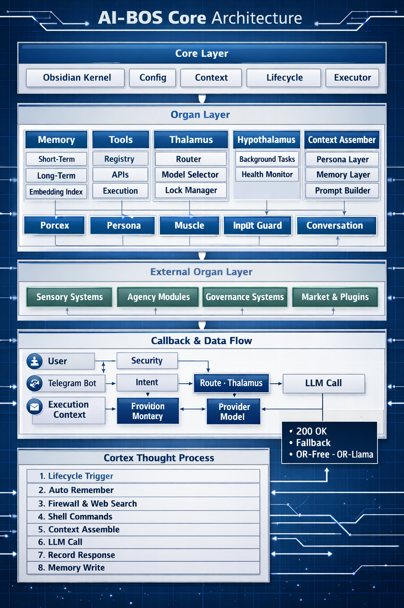

  

  
   
  <em>AMPM AI 器官系統架構圖 — 22 個器官構成完整 AI 生命體</em>

  <b>🧠 Kernel（決策核心）</b> ｜
  <b>🟢 Public（公開框架）</b> ｜
  <b>🔬 Experimental（實驗模組）</b>

<table align="center">
  <tr>
    <th>器官</th><th>類別</th><th>功能</th>
  </tr>
  <tr><td>🧠 Brain</td><td align="center">🧠</td><td>皮質、視丘、島葉 — 決策中樞</td></tr>
  <tr><td>🛡️ Governance</td><td align="center">🧠</td><td>權限引擎、防火牆、執行政策</td></tr>
  <tr><td>⚙️ Runtime</td><td align="center">🧠</td><td>執行環境、上下文組裝、決策權限</td></tr>
  <tr><td>🧬 Core</td><td align="center">🧠</td><td>代理智慧、自動學習、反饋迴圈</td></tr>
  <tr><td>🔀 Decisions</td><td align="center">🧠</td><td>決策流程、優先級、協調</td></tr>
  <tr><td>🌿 Evolution</td><td align="center">🧠</td><td>自適應邏輯、自我優化</td></tr>
  <tr><td>💭 Memory</td><td align="center">🧠</td><td>記憶系統（工作/語意/情節）</td></tr>
  <tr><td>🌐 LLM</td><td align="center">🧠</td><td>多層 LLM 路由（Ollama/OpenRouter/DeepSeek）</td></tr>
  <tr><td>🤖 Agents</td><td align="center">🧠</td><td>多代理系統總控</td></tr>
  <tr><td>🫁 Breath</td><td align="center">🧠</td><td>呼吸調節器 — 請求節流</td></tr>
  <tr><td>👃 Nose</td><td align="center">🧠</td><td>嗅覺感測器 — 輸入過濾</td></tr>
  <tr><td>🦴 Skeleton</td><td align="center">🟢</td><td>框架支架 — 公開 scaffold</td></tr>
  <tr><td>📊 Dashboard</td><td align="center">🟢</td><td>輕量監控 UI</td></tr>
  <tr><td>🔧 Tools</td><td align="center">🟢</td><td>工具介面與公開裝飾器</td></tr>
  <tr><td>📋 Lifecycle</td><td align="center">🟢</td><td>生命週期管理</td></tr>
  <tr><td>🩸 Blood</td><td align="center">🔬</td><td>血液循環 — 資料流通</td></tr>
  <tr><td>🌉 Bridge</td><td align="center">🔬</td><td>橋梁 — 跨系統通訊</td></tr>
  <tr><td>🔌 Circuit</td><td align="center">🔬</td><td>電路 — 神經連結</td></tr>
  <tr><td>🧬 DNA</td><td align="center">🔬</td><td>DNA 繼承 — 個性遺傳</td></tr>
  <tr><td>💰 Economy</td><td align="center">🔬</td><td>成本意識與資源分配</td></tr>
  <tr><td>🎯 Goals</td><td align="center">🔬</td><td>目標層級管理</td></tr>
  <tr><td>🛡️ Immune</td><td align="center">🔬</td><td>免疫系統 — 異常檢測</td></tr>
  <tr><td>🧠 Meta</td><td align="center">🔬</td><td>後設認知</td></tr>
  <tr><td>💪 Muscle</td><td align="center">🔬</td><td>肌肉 — 動作執行</td></tr>
  <tr><td>🧬 Nerve</td><td align="center">🔬</td><td>神經 — 信號傳遞</td></tr>
  <tr><td>🧬 Organs</td><td align="center">🔬</td><td>器官系統基礎</td></tr>
  <tr><td>🎭 Society</td><td align="center">🔬</td><td>社會治理</td></tr>
  <tr><td>⏳ Temporal</td><td align="center">🔬</td><td>時間意識</td></tr>
  <tr><td>🤝 Trust</td><td align="center">🔬</td><td>信任系統</td></tr>
  <tr><td>🗑️ Waste</td><td align="center">🔬</td><td>廢棄物管理</td></tr>
  <tr><td>🌍 Civilization Memory</td><td align="center">🔬</td><td>文明記憶</td></tr>
</table>

# AMPM-AIOPS Public Framework / AMPM-AIOPS 公開框架

## English

This repository serves as the public-facing framework and ecosystem hub for the AMPM AI Operating System.

### 📍 Positioning

AMPM-AIOPS is the **public framework** layer, responsible for:
- SDKs and plugin interfaces
- Public APIs and documentation
- Example agents and dashboards
- Ecosystem growth and community contributions

### 🔒 Core Intelligence Location

The true AI decision intelligence (routing, context control, governance, evolution, orchestration intelligence) resides in the private kernel repository:
**AMPM-KEL**

This separation ensures that the core intellectual property remains protected while enabling open ecosystem development.

### 📁 Directory Structure

- `assets/` - Public static resources (icons, banners, etc.)
- `scripts/` - Public utility scripts (installation, setup, etc.)
- `docs/` - Public documentation and guides
- `examples/` - Example agents and workflows
- `dashboard/` - Lite monitoring and runtime UI (public-facing)
- `OPS` - Public operations scripts

### 🔗 Integration with AMPM-KEL

Public components interact with the private kernel strictly through well-defined interfaces:
- Plugin Interface
- SDK Interface
- Event Bus Interface
- Lifecycle Interface

Direct internal imports of AMPM-KEL components are strictly prohibited.

### 🛡️ Security Boundary

To maintain the integrity of the AI brain:
- Plugins cannot modify routing, governance, context policies, or memory ranking
- SDKs provide only public-facing capabilities
- Dashboard components are read-only monitoring tools
- All decision-making authority remains within AMPM-KEL

---

## 中文

此倉庫作為 AMPM AI 作業系統的公開框架和生態系統中心。

### 📍 定位

AMPM-AIOPS 是 **公開框架** 層，負責：
- SDK 和插件介面
- 公開 API 和文件
- 範例代理和儀表板
- 生態系統成長和社群貢獻

### 🔒 核心智慧位置

真正的 AI 決策智慧（路由、上下文控制、治理、演化、協調智慧）位於私有內核倉庫：
**AMPM-KEL**

這種分離確保了核心智慧財產受到保護，同時實現開放的生態系統開發。

### 📁 目錄結構

- `assets/` - 公開靜態資源（圖標、橫幅等）
- `scripts/` - 公開工具腳本（安裝、設置等）
- `docs/` - 公開文件和指南
- `examples/` - 範例代理和工作流程
- `dashboard/` - 輕量監控和運行時 UI（公開面向）
- `OPS` - 公開運維腳本

### 🔗 與 AMPM-KEL 的整合

公開組件嚴格通過明確定義的介面與私有內核互動：
- 插件介面
- SDK 介面
- 事件總線介面
- 生命週期介面

嚴格禁止直接導入 AMPM-KEL 內部組件。

### 🛡️ 安全邊界

為維護 AI 大腦的完整性：
- 插件不能修改路由、治理、上下文政策或記憶排名
- SDK 僅提供面向公眾的能力
- 儀表板組件是唯讀監控工具
- 所有決策權限都保留在 AMPM-KEL 內

---
*Last updated: 2026-05-23 / 最近更新：2026-05-23*
