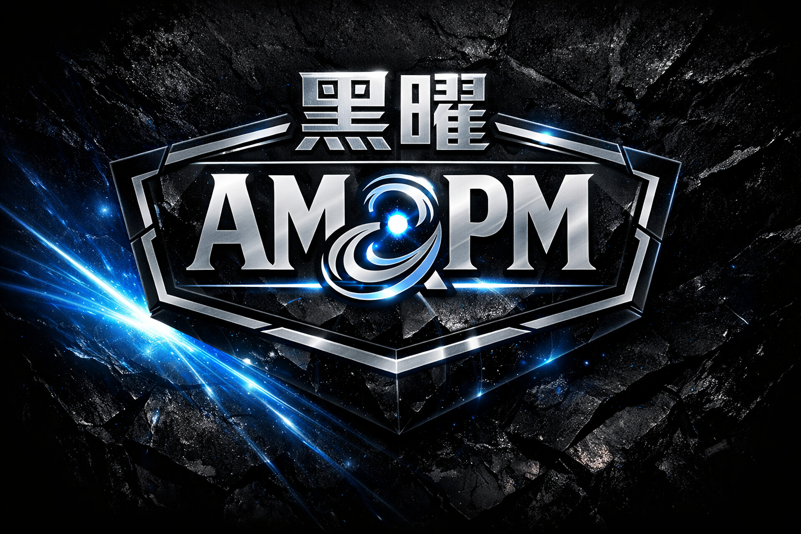

<h1 align="center" style="color:#e94560; border-bottom:1px solid #30363d; padding-bottom:8px;">AI-BOS Roadmap</h1>

<h2 align="center" style="color:#58a6ff;">✅ v1.0.0 (Current) — Life Body Foundation</h2>

- [x] 54+ Organ architecture with biological metaphors
- [x] Brain (Obsidian) with LangGraphExecutor modular split
- [x] Triple-layer memory: working → semantic → civilization (episodic/failure/evolution)
- [x] Governance layer: gatekeeper → security zones → isolation → audit → stable mode
- [x] Immune system: firewall, breaker, guard, sandbox, risk scorer
- [x] Meta-cognition: self-observer, reflection engine, strategy suggester
- [x] Evolution cycle: absorb → learn → select → remember → enhance → exclude
- [x] Repair orchestrator: unified repair execution
- [x] Self-reflect / self-repair / self-evolve behavioral modules
- [x] Organ Registry v2: multi-organ, versioning, dependencies, health checks
- [x] Audit layer: event_log, tool_usage, repair, evolution logs
- [x] Civilization snapshot for backup & audit
- [x] Baseline 29/29 · Stability 20/20 · Isolation 17/17

<h2 align="center" style="color:#58a6ff;">🚧 v1.1 — Autonomous Growth</h2>

- [ ] Autonomous tool creation (self_upgrade)
- [ ] Cross-organ dependency auto-resolution
- [ ] Evolution-driven code generation
- [ ] Version manager with SemVer + rollback snapshots

<h2 align="center" style="color:#58a6ff;">🧬 v1.2 — Multi-Life Orchestration</h2>

- [ ] Multi-brain orchestration (swarm mode)
- [ ] Inter-organ communication via EventBus
- [ ] Organ replication and migration

<h2 align="center" style="color:#58a6ff;">🌐 v2.0 — Production Platform</h2>

- [ ] Web dashboard
- [ ] Plugin marketplace
- [ ] REST API gateway
- [ ] Multi-tenant support
- [ ] Container-native deployment

 

  AMPM-AIOPS — AI OS Public Framework

